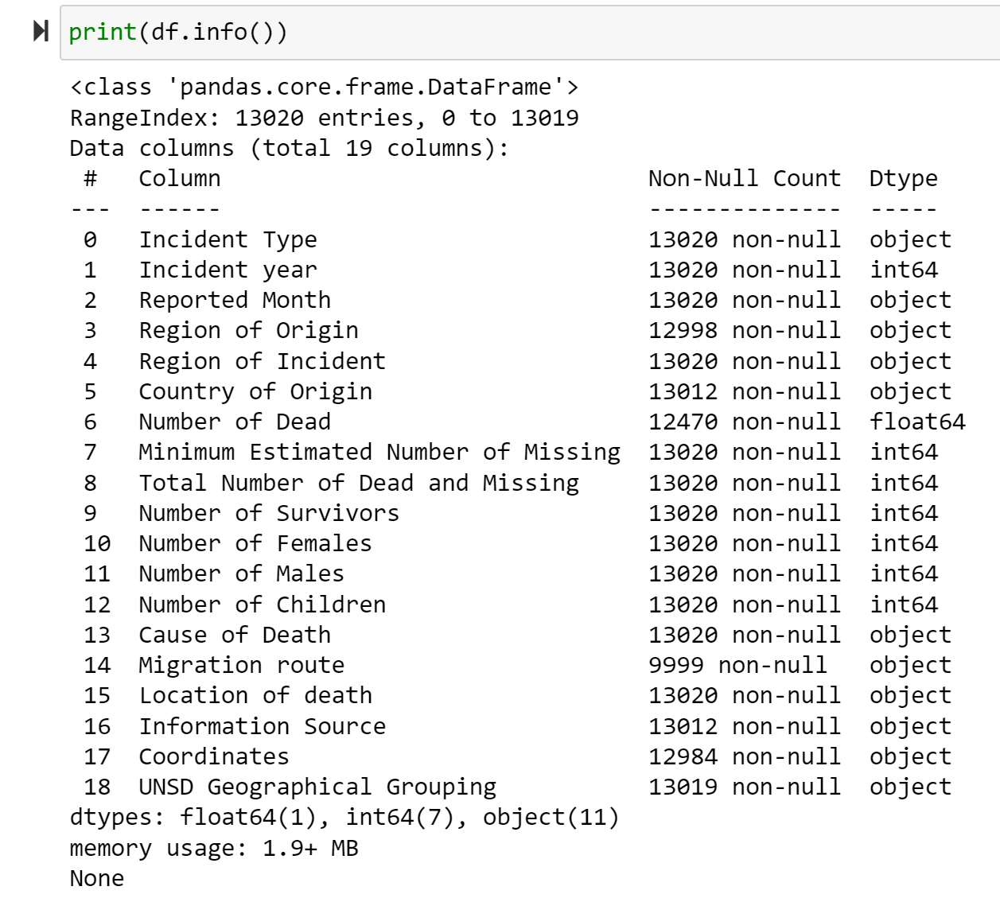
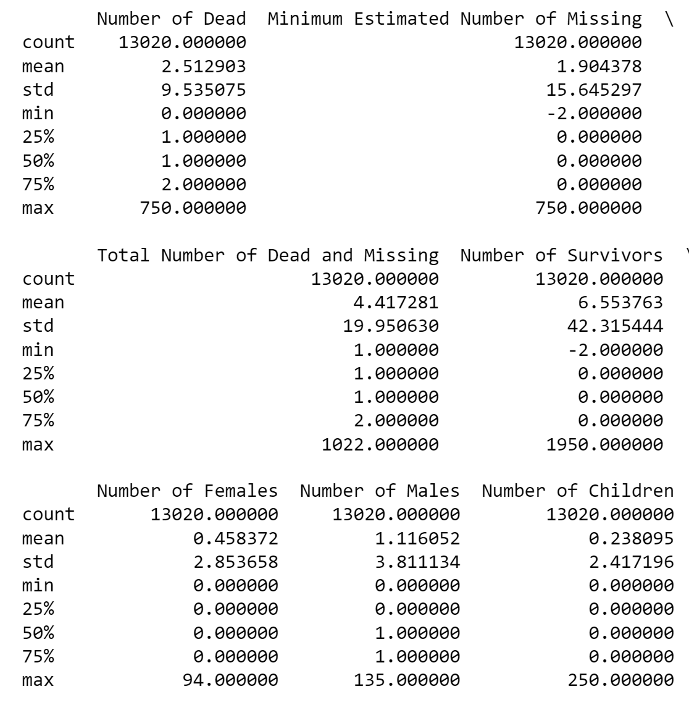
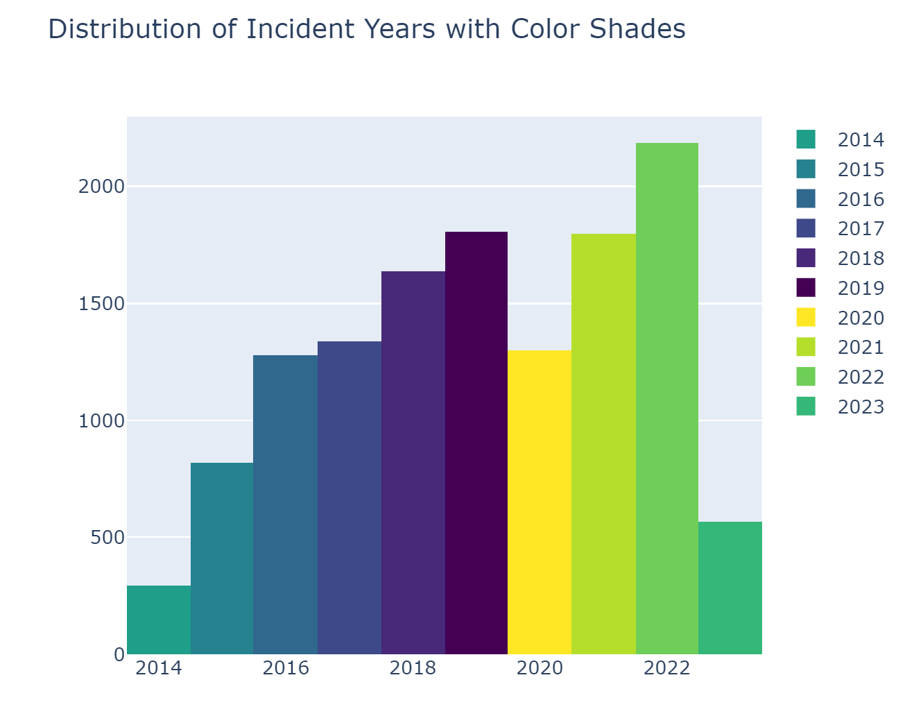
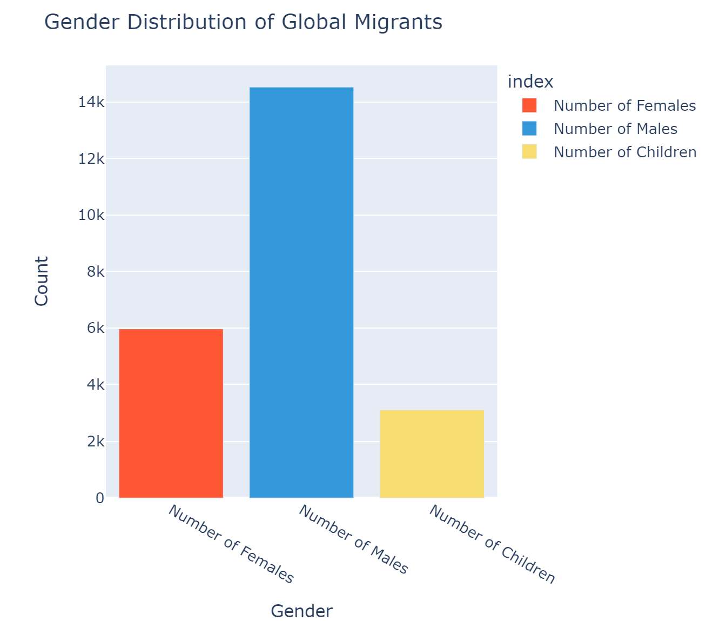
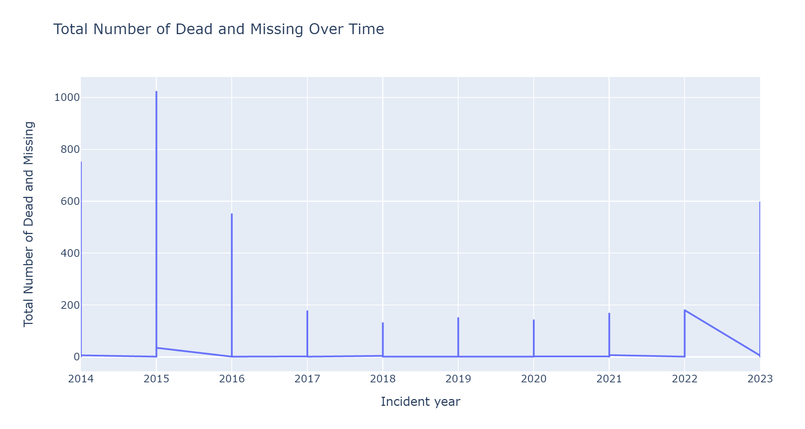
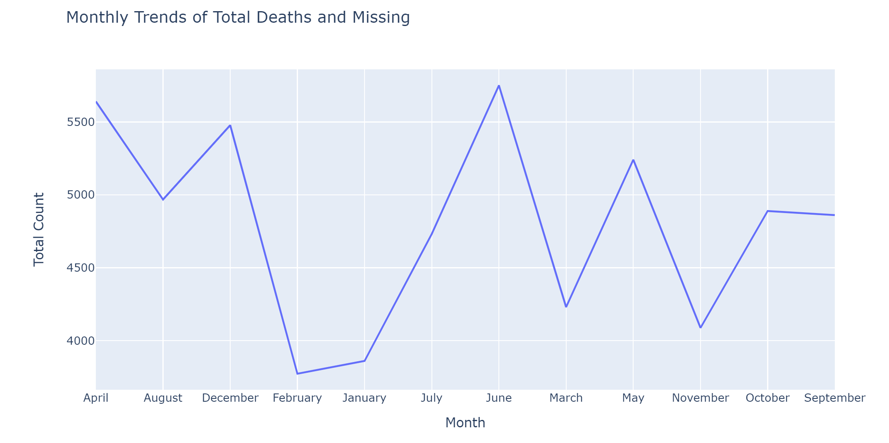
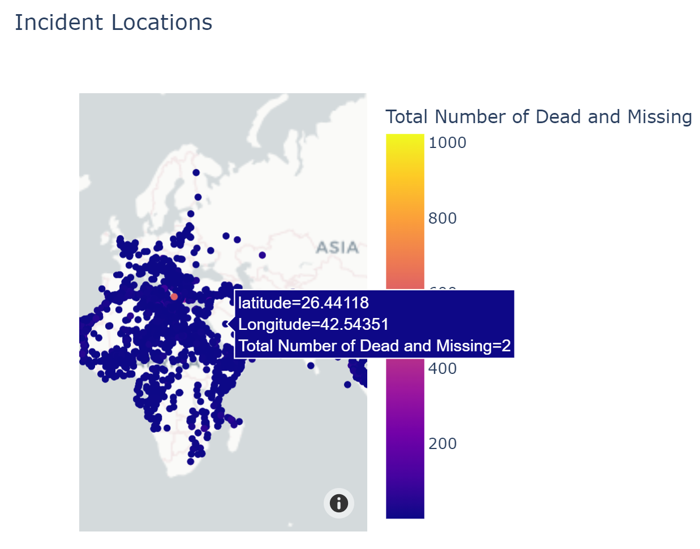

# Global Missing Migrants:
1.	**Data Collection:** Acquired a dataset from Kaggle.com containing information on Global Missing Migrants.

3.	**Exploratory Data Analysis:** Conducted comprehensive EDA to understand the dataset. Key steps included:

-	Summary Statistics: Computed summary statistics for numerical columns to grasp the data's overall characteristics.

-	Data Preprocessing: Divided the coordinates column into longitude and latitude components for better analysis. Addressed missing values in the "NUMBER OF DEAD" column by replacing them with zeros to ensure clean visualization.
   ' df[['latitude', 'Longitude']] = df['Coordinates'].str.split(', ', expand=True).astype(float)  '

3.	**Data Visualization:** Employed various visualization techniques to gain insights:
-	Histogram: Utilized histograms to depict the distribution of incidents across the years.
 	
-	Bar Chart: Created bar charts to visualize the gender distribution among migrants.
 	
-	Line Chart: Employed line charts to identify patterns and trends in the number of deceased migrants over the years and on a monthly basis.
            
4.	**Geospatial Visualization:** Enhanced understanding by plotting data points on a world map. This visualization method highlighted locations with significant numbers of deceased and missing migrants for improved spatial insights.
By combining these techniques, this project provides a comprehensive analysis of Global Missing Migrants' data, offering valuable insights into trends, patterns, and spatial distributions.

