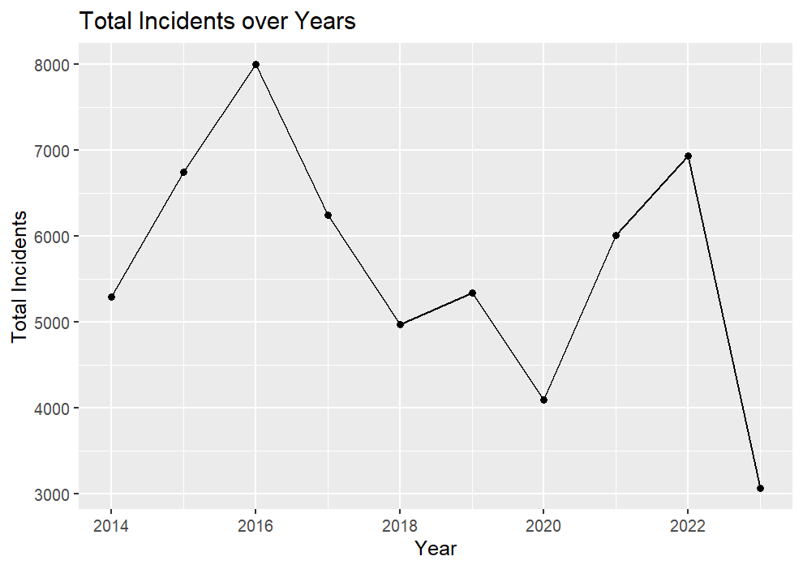
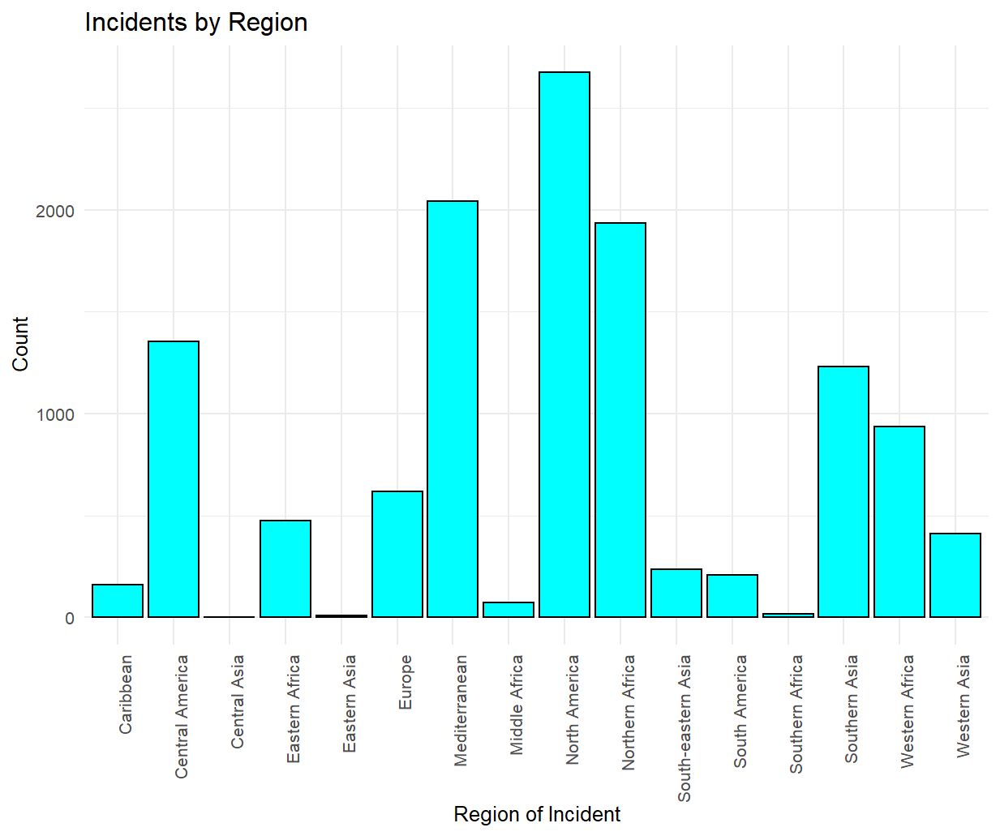
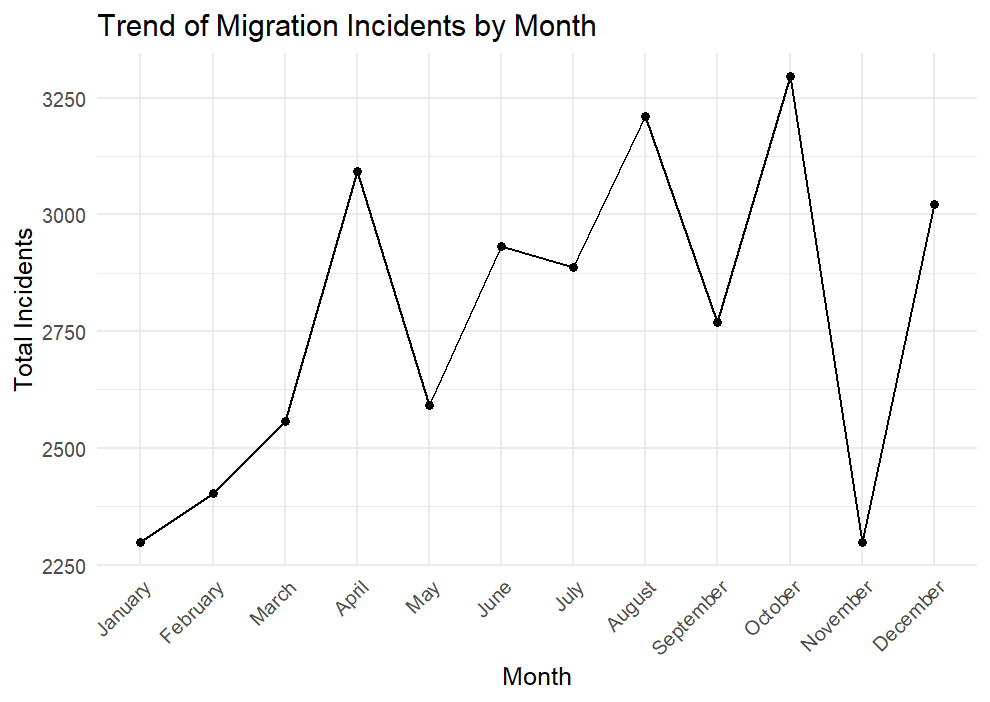
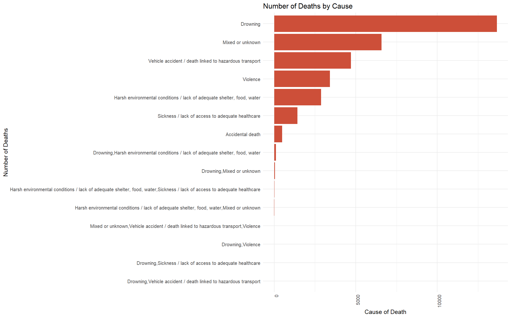
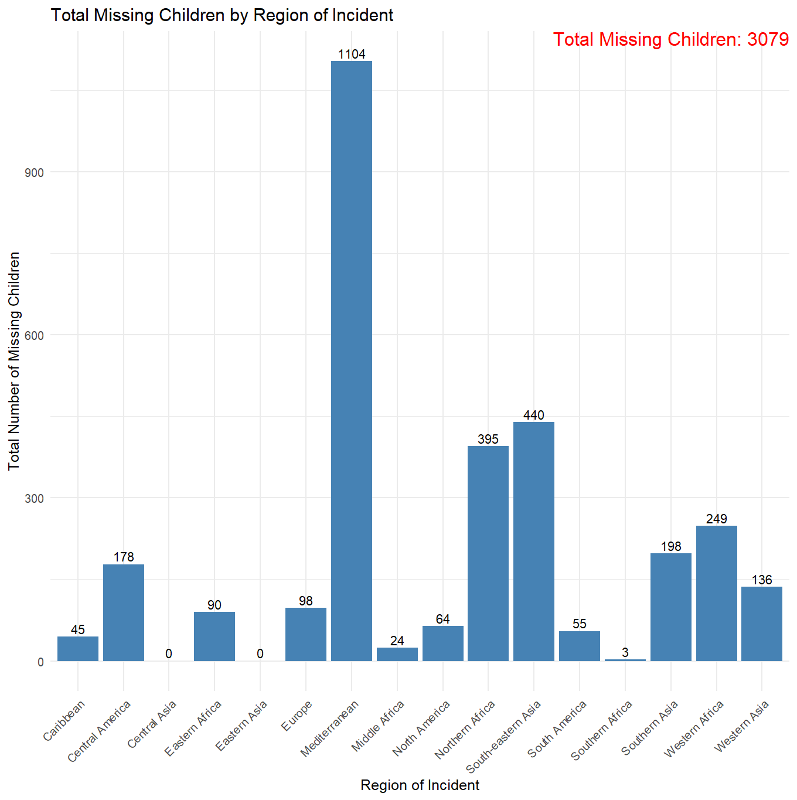
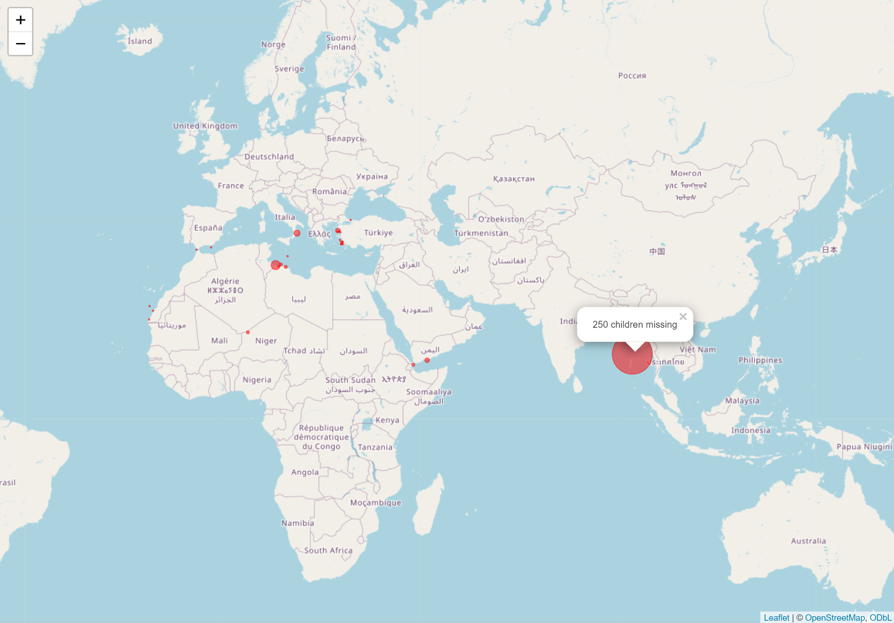

 ## The Unfortunate Routes to a Better Life
(An Exploratory Data Analysis of Missing or Dead Migrants Globally from 2014 to 2023)

This report presents an exploratory data analysis (EDA) conducted on a dataset encompassing incidents of missing or dead migrants worldwide from the years 2014 to 2023. Utilizing a range of data manipulation and visualization tools in R, including libraries for statistical analysis and geospatial mapping, this analysis aims to uncover patterns and insights into the tragic outcomes faced by many in pursuit of a better life. Through meticulous data preparation and a series of visualizations, this report highlights the scale, demographics, regional differences, and causes of these incidents, with a special focus on the vulnerable group of missing children.

### Data Preparation
The dataset, obtained from Kaggle, initially contained 13,020 observations across 19 columns. A thorough cleaning process addressed 632 duplicate observations and managed missing values with statistical techniques appropriate to the data distribution. Specifically, median imputation was employed for the "Number of Dead" variable due to its significant right skew and high kurtosis, which suggested a non-normal distribution with pronounced outliers. The "Migration Route" variable, where missing, was filled with "Unknown" to preserve the integrity of the dataset for analysis. These preparatory steps ensured a clean and reliable dataset, reducing the observations to 12,388 for the EDA.

### Analysis and Findings
#### Trend Over Time:
An initial time series analysis revealed a fluctuating yet distressingly high incidence of migrant deaths and disappearances over the study period. The year 2016 was notably the most tragic, with 8,084 incidents recorded, underscoring a grave trend that saw a slight decrease in subsequent years before rising again in 2022 with 7,141 incidents.

 
### Regional Hotspots:
Further analysis focused on identifying regions with the highest incidences. North America, the Mediterranean, and North Africa emerged as the areas most afflicted by migrant tragedies, pointing towards significant geographical patterns in these unfortunate events.

 
#### Temporal Patterns:
Exploration of the timing of migrations indicated notable peaks in incidents during April, August, and October. While the underlying causes of these spikes remain multifaceted and complex, they may be related to seasonal variations, the operational periods of smuggling networks, and other socio-political factors influencing migration routes.

 

### Causes of Death:
The leading causes of death were drowning, followed by a mix of unknown factors, vehicle accidents, violence, and harsh environmental conditions. This stark hierarchy of causes highlights the perilous conditions migrants face on their journeys.

 
 
#### Focus on Missing Children:
A dedicated analysis of missing children revealed a total of 3,079 cases, with the Mediterranean, Southern Asia, and North Africa being the regions most affected. This demographic analysis underscores the heightened vulnerability of children in these migration crises.

#### Geospatial Analysis:
A geospatial mapping of incidents where at least 10 children were recorded missing offered a vivid illustration of the geographic spread of these tragedies, pinpointing specific areas of high risk.

 
### Conclusion
The exploratory data analysis conducted herein sheds light on the somber realities faced by migrants, particularly children, as they navigate perilous routes in search of a better life. The findings call for a global reckoning with these humanitarian crises, urging collective action towards creating safer pathways for migration and extending support to those fleeing adversity. As we strive to understand and mitigate these tragedies, it is crucial to remember the human lives behind the numbers—a testament to the indomitable human spirit seeking hope against the odds.

